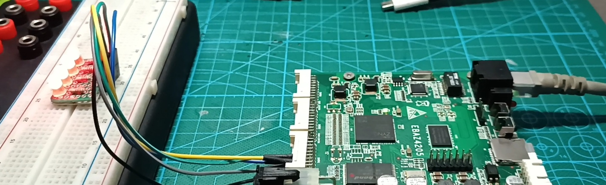

### Instruction
- Upload `EBAZ4205_2_AXIGPIO.overlay/` folder into EBAZ4205 via SFTP into folder `/home/xilinx/pynq/overlays/`
- Upload and open `EBAZ4205_2_AXIGPIO.ipynb` to EBAZ4205 Jupyter Notebook (`http://<EBAZ4205_IP>:9090`)
- If you want to create your own overlay, follow the [Vivado AXI GPIO Project Example](../../Vivado/2_AxiGPIO/EBAZ4205_2_AXIGPIO.vivado/).
### AxiGPIO Experiment
- Control 4 led using AxiGPIO
