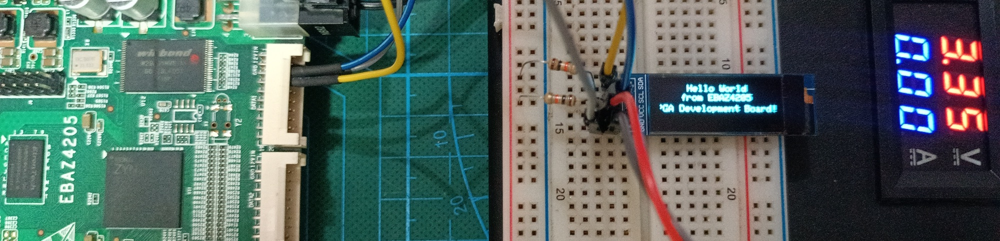

### Instruction
- Upload `EBAZ4205_3_AxiI2C.overlay/` folder into EBAZ4205 via SFTP into folder `/home/xilinx/pynq/overlays/`
- Upload and open `EBAZ4205_3_AxiI2C.ipynb` to EBAZ4205 Jupyter Notebook (`http://<EBAZ4205_IP>:9090`)
- Upload and open `font5x8.bin` to EBAZ4205 Jupyter Notebook (`http://<EBAZ4205_IP>:9090`)
- If you want to create your own overlay, follow the [Vivado AXI I2C Project Example](../../Vivado/3_AxiI2C/EBAZ4205_3_AxiI2C.vivado/).
### AxiI2C Experiment
- Write char in I2C LCD SSD1306 128x32 using AxiI2C
