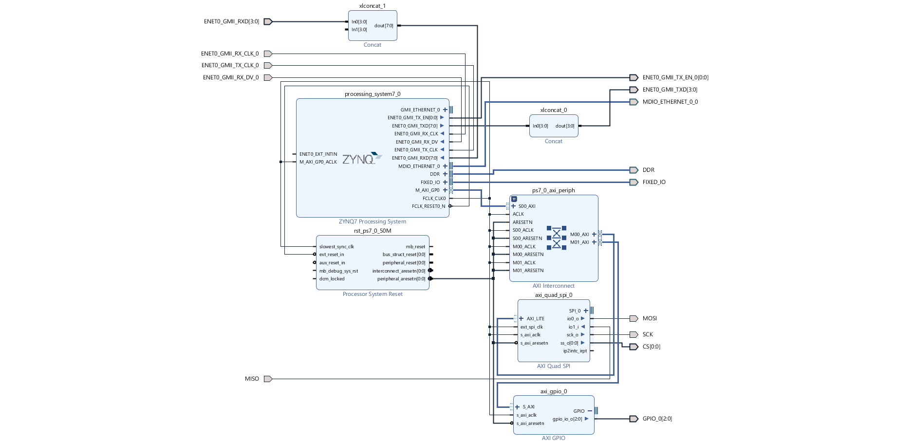

### Create `EBAZ4205_4_AXIQuadSPI` Project
- Create a New Vivado Project with name `EBAZ4205_4_AXIQuadSPI`,
- Copy `EBAZ4205_4_AXIQuadSPI.tcl` above into `EBAZ4205_4_AXIQuadSPI` project folder using file explorer,
- Open TCL Console in Vivado (bottom section, first tab), run this command,
```
source EBAZ4205_4_AXIQuadSPI.tcl
```
- Block design will be generated.
- source the `io.xdc` as constraint file.
- Run Synthesis -> Implementation -> Generate Bitstream.
- Find `.bit`, `.tcl` & `.hwh` files inside `EBAZ4205_4_AXIQuadSPI` project folder.
- Copy that and upload into `~/pynq/overlays/` folder of PYNQ OS running in EBAZ4205.
### Project Info
- Block Design implemented in `EBAZ4205_4_AXIQuadSPI` project,
