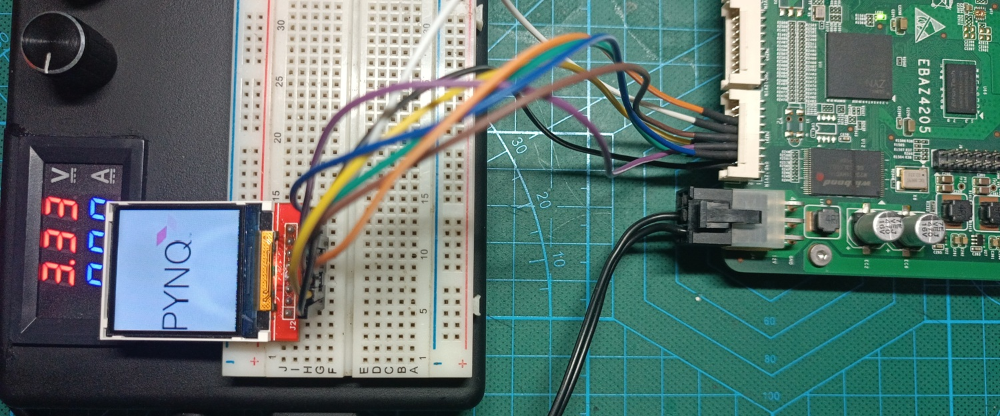

### Instruction
- Upload `EBAZ4205_4_AXIQuadSPI.overlay/` folder into EBAZ4205 via SFTP into folder `/home/xilinx/pynq/overlays/`
- Upload and open `EBAZ4205_4_AXIQuadSPI.ipynb` to EBAZ4205 Jupyter Notebook (`http://<EBAZ4205_IP>:9090`)
- Upload and open `pynq.jpg` and `xilinx.jpg` to EBAZ4205 Jupyter Notebook (`http://<EBAZ4205_IP>:9090`)
### AXIQuadSPI Experiment
- Draw image to SPI LCD TFT ST7735
