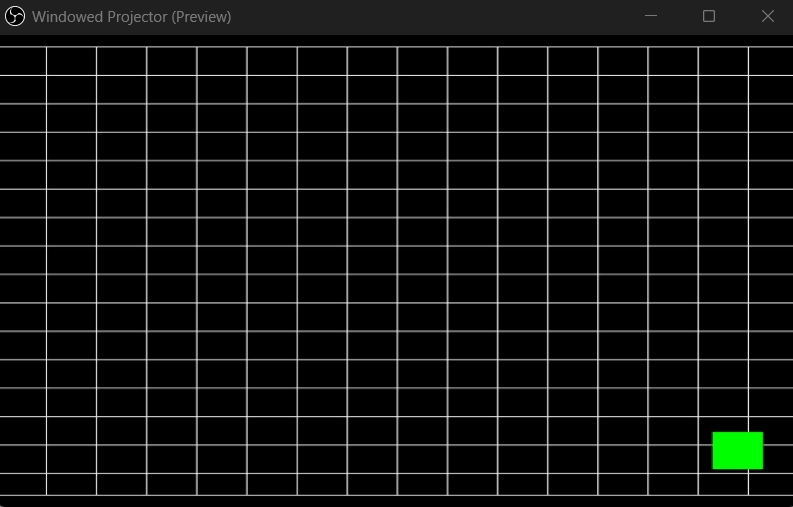
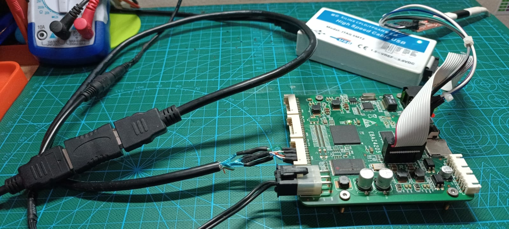

### Create `EBAZ4205_5_DVI_TPG` Project
- Create a New Vivado Project with name `EBAZ4205_5_DVI_TPG`,
- Copy `EBAZ4205_5_DVI_TPG.tcl` above into `EBAZ4205_5_DVI_TPG` project folder using file explorer,
- Open TCL Console in Vivado (bottom section, first tab), run this command,
```
source EBAZ4205_5_DVI_TPG.tcl
```
- Block design will be generated.
- source the `io.xdc` as constraint file.
- Run Synthesis -> Implementation -> Generate Bitstream.
- Export Hardware Platform & Launch Xilinx SDK.
- Currenly only support Xilinx SDK implementation [XilinxSDK/5_DVI_TPG](../../../XilinxSDK/5_DVI_TPG/). 
- Experiment result,
    - TPG `XTPG_BKGND_CROSS_HATCH` with animated 50x50 pixel Green Box.
    - DVI output is capured by **HDMI Video Capture** and display the result in **OBS**.<br><br>
    <br><br>
    