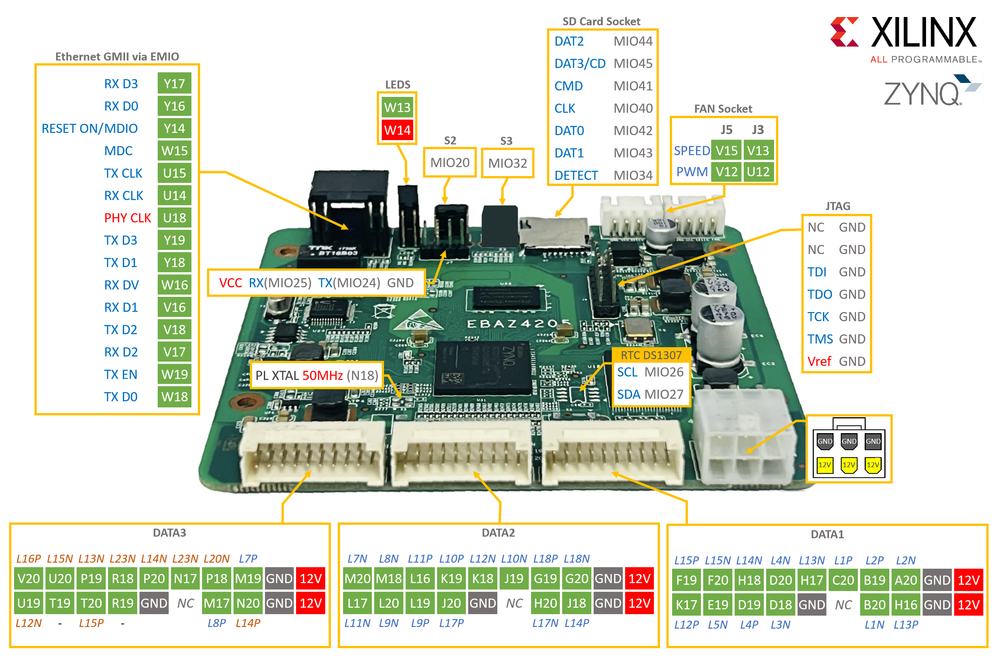

# EBAZ4205 PROJECT
*EBAZ4205 (Zynq-7010) projects — from PYNQ & Vivado designs to Xilinx SDK apps and custom expansion board PCB.*
- 📄 Install Board Files EBAZ4205 in Vivado, 👉 [Board Files](https://github.com/Muhammad-Yunus/EBAZ4205_Vivado/tree/main/Documents/Board%20files)
- 💿 Download PYNQ OS for EBAZ4205 from, 👉 [Release Page](https://github.com/Muhammad-Yunus/EBAZ4205_PROJECT/releases/tag/v1.0)
- 📁 Follow PYNQ tutorial in `PYNQ/` folder.
- 📄 Datasheet :
     - You can download or view the datasheet here 👉 [EBAZ4205 Datasheet PDF](/resource/ebaz4205_schematic.pdf)

### EBAZ4205 Pinout

