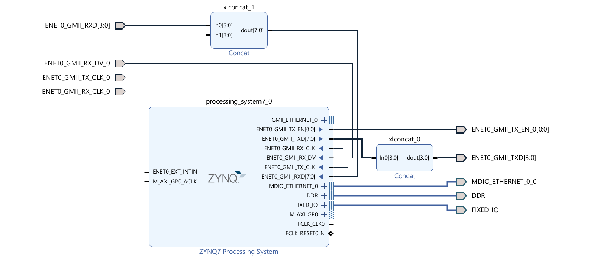

### Create `EBAZ4205_1_PS` Project
- Create a New Vivado Project with name `EBAZ4205_1_PS`,
- Copy `EBAZ4205_1_PS.tcl` above into `EBAZ4205_1_PS` project folder using file explorer,
- Open TCL Console in Vivado (bottom section, first tab), run this command,
```
source EBAZ4205_1_PS.tcl
```
- Block design will be generated.
- source the `io.xdc` as constraint file.
- Run Synthesis -> Implementation -> Generate Bitstream.
- [PYNQ PS Example](../../../PYNQ/1_PS/) :
    - Find `.bit`, `.tcl` & `.hwh` files inside `EBAZ4205_1_PS` project folder.
    - Copy that and upload into `~/pynq/overlays/` folder of PYNQ OS running in EBAZ4205.
- [Xilinx SDK PS Example (Hello World)](../../../XilinxSDK/1_PS)
    - Export Hadware Platform
    - Launch Xilinx SDK
### Project Info
- Block Design implemented in `EBAZ4205_1_PS` project,
