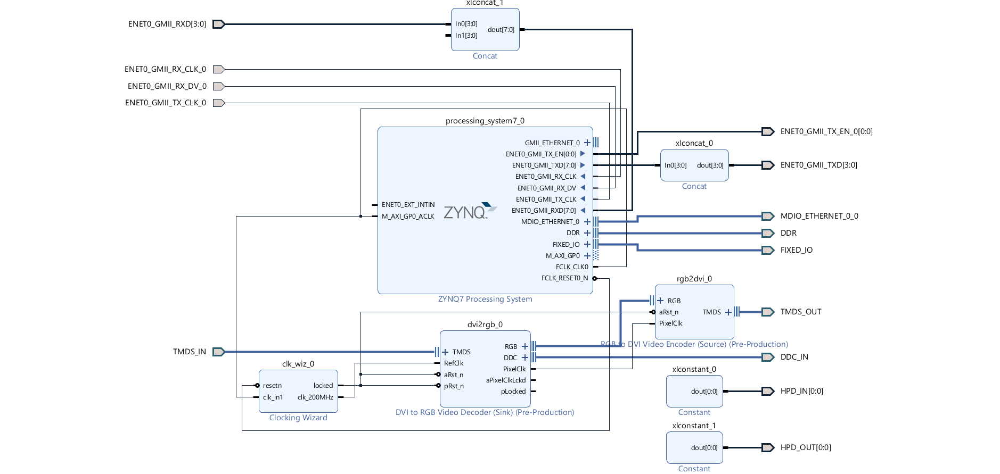

### Create `EBAZ4205_6_HDMI_Passthrough` Project
- Create a New Vivado Project with name `EBAZ4205_6_HDMI_Passthrough`,
- Clone [Digilent/vivado-library](https://github.com/Digilent/vivado-library/tree/master) repo to your computer,
    - Import into Vivado > IP Repository.
- Copy `EBAZ4205_6_HDMI_Passthrough.tcl` on this repo into `EBAZ4205_6_HDMI_Passthrough` project folder using file explorer,
- Open TCL Console in Vivado (bottom section, first tab), run this command,
```
source EBAZ4205_6_HDMI_Passthrough.tcl
```
- Block design will be generated.
- source the `io.xdc` as constraint file.
- Run Synthesis -> Implementation -> Generate Bitstream.
- [PYNQ HDMI Passthrough Example](../../../PYNQ/6_HDMI_Passthrough/) :
    - Find `.bit`, `.tcl` & `.hwh` files inside `EBAZ4205_6_HDMI_Passthrough` project folder.
    - Copy that and upload into `~/pynq/overlays/` folder of PYNQ OS running in EBAZ4205.
- [Xilinx SDK HDMI Passthrough Example](../../../XilinxSDK/6_HDMI_Passthrough/)
    - Export Hadware Platform
    - Launch Xilinx SDK
### Project Info
- Block Design implemented in `EBAZ4205_6_HDMI_Passthrough` project,
