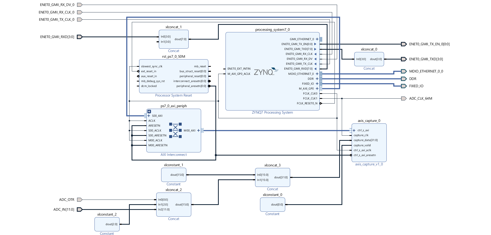

### Create `EBAZ4205_7_AD9226_DATA_CAPTURE` Project
- Create a New Vivado Project with name `EBAZ4205_7_AD9226_DATA_CAPTURE`,
- Import [CustomIP/axis_captire_v1.0](../CustomIP/axis_capture_v1.0/) into Vivado > IP Repository.
- Copy `EBAZ4205_7_AD9226_DATA_CAPTURE.tcl` on this repo into `EBAZ4205_7_AD9226_DATA_CAPTURE` project folder using file explorer,
- Open TCL Console in Vivado (bottom section, first tab), run this command,
```
source EBAZ4205_7_AD9226_DATA_CAPTURE.tcl
```
- Block design will be generated.
- source the `io.xdc` as constraint file.
- Run Synthesis -> Implementation -> Generate Bitstream.
- [PYNQ AD9226 Data Capture Example](../../../PYNQ/7_AD9226_ADC/) :
    - Find `.bit`, `.tcl` & `.hwh` files inside `EBAZ4205_7_AD9226_DATA_CAPTURE` project folder.
    - Copy that and upload into `~/pynq/overlays/` folder of PYNQ OS running in EBAZ4205.
- [Xilinx SDK AD9226 Data Capture Example](../../../XilinxSDK/7_AD9226_ADC/)
    - Export Hadware Platform
    - Launch Xilinx SDK
### Project Info
- Block Design implemented in `EBAZ4205_7_AD9226_DATA_CAPTURE` project,
