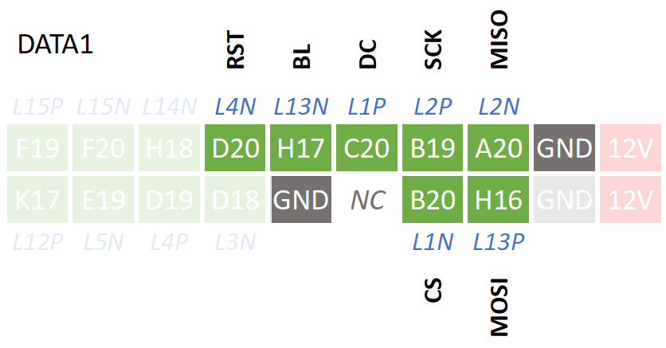

# Project Instruction
- The `src/` folder contain application code for LVGL demo in Xilinx SDK 2019.1 for EBAZ4205.
- Clone LVGL (https://github.com/lvgl/lvgl) into that `src/` folder.
- To get started, 
    - Export Hardware Platform from [Vivado Project - AXI Quad SPI Example](../../../PYNQ/4_AxiQuadSPI/EBAZ4205_4_AXIQuadSPI.vivado/)
    - Launch Xilinx SDK from Vivado,
    - Then create New Application Project with Name `SPI_LCD_ST7735_LVGL`,
    - Choose Project Template `Hello World`
    - Copy everything inside the `src/` folder above into the `src/` folder of your `SPI_LCD_ST7735_LVGL` project. 
    - Open Project Properties > C/C++ Build > Settings > Directories. 
        - Add `src/gui/` and `src/lvgl/` as include paths.   
    - Build and upload to EBAZ4205 using Xilinx Platform USB Cable.
- SPI Pin used, 
    - SPI pin is assigned to `A20` (MISO), `H16` (MOSI), `B19` (SCK), `B20` (CS) in `DATA1 PORT`, 
    - Also LCD related GPIO via AxiGPIO, `C20` (LCD DC), `H17` (LCD Backlight), `D20` (LCD RESET)
        