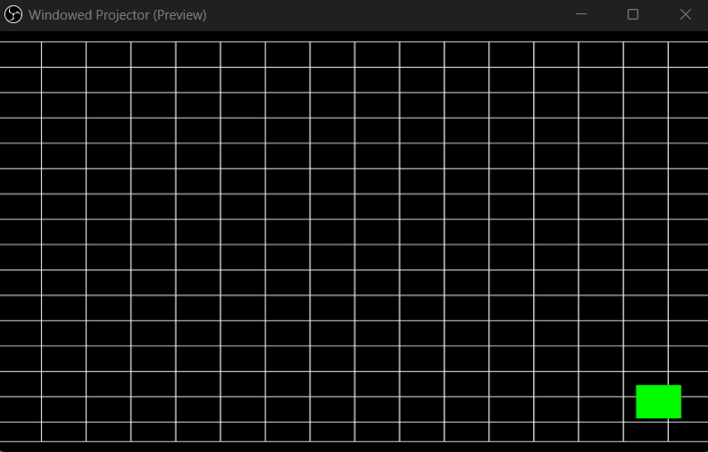

# Project Instruction
- The `src/` folder contain application code for running Test Pattern Generator (TPG) on DVI interface in Xilinx SDK 2019.1 for EBAZ4205.
- To get started, 
    - Export Hardware Platform from [Vivado Project - DVI TPG](../../PYNQ/5_DVI_TPG/EBAZ4205_5_DVI_TPG.vivado/)
    - Launch Xilinx SDK from Vivado,
    - Then create New Application Project with Name `DVI_TPG_Test`,
    - Choose Project Template `Hello World`
    - Copy everything inside the `src/` folder above into the `src/` folder of your `DVI_TPG_Test` project. 
    - Build and upload to EBAZ4205 using Xilinx Platform USB Cable.
- DVI/TMDS Pin used, 
    - `TMDS 0` = `BLUE` Cable
    - `TMDS 1` = `GREEN` Cable
    - `TMDS 2` = `RED` Cable
    - `TMDS CLK` = `BROWN` Cable
    
- Experiment result,
    - TPG `XTPG_BKGND_CROSS_HATCH` with animated 50x50 pixel Green Box.
    - DVI output is capured by **HDMI Video Capture** and display the result in **OBS**.  
      
    