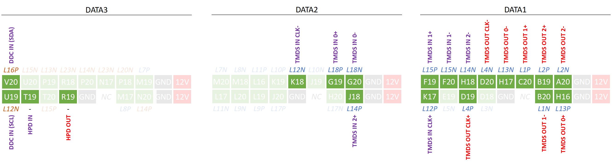
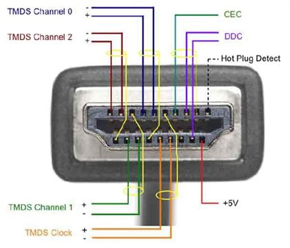
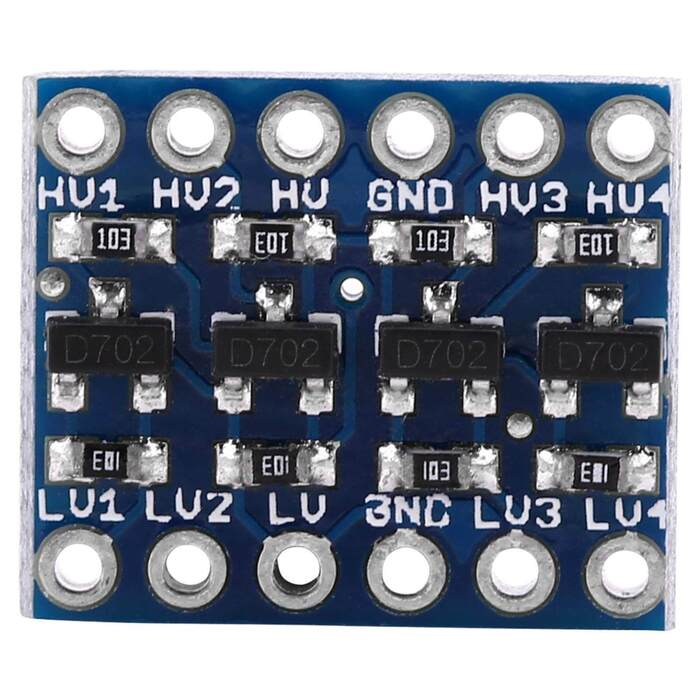
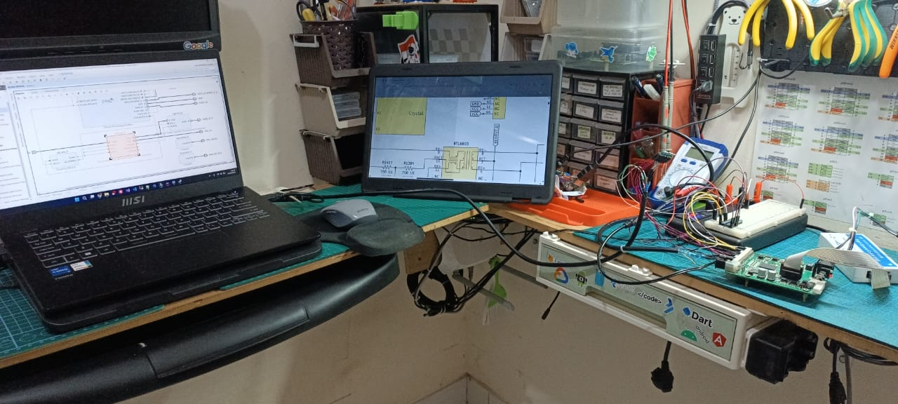

# Project Instruction
- To get started, 
    - Export Hardware Platform from [Vivado Project - HDMI Passthrough](../../Vivado/6_HDMI_Passthrough/EBAZ4205_6_HDMI_Passthrough.vivado/)
    - Launch Xilinx SDK from Vivado,
    - Then create New Application Project with Name `HDMI_Passthroug_Test`,
    - Choose Project Template `Hello World`
    - Leave the helloworld.c as is, since we use the code to activate PS.
        - So it can supply clock to the PL.
    - Build and upload to EBAZ4205 using Xilinx Platform USB Cable.
- **HDMI OUT** Pin :
    - `TMDS Pin` in HDMI / DVI interface, 
        - `TMDS 0` = `BLUE` Cable
        - `TMDS 1` = `GREEN` Cable
        - `TMDS 2` = `RED` Cable
        - `TMDS CLK` = `BROWN` Cable
    - `HPD Pin` for Hot Plug Detection
        - ⚠️⚠️⚠️Use Level Shifter 3.3V to 5V.
        - EBAZ4205 HPD Pin (3.3v) --> Level Shifter 3.3V to 5V --> HDMI Out Cable HPD Pin (5V).
- **HDMI IN** Pin :
    - `TMDS Pin` in HDMI / DVI interface, 
        - `TMDS 0` = `BLUE` Cable
        - `TMDS 1` = `GREEN` Cable
        - `TMDS 2` = `RED` Cable
        - `TMDS CLK` = `BROWN` Cable
    - `HPD Pin` for Hot Plug Detection
        - ⚠️⚠️⚠️Use Level Shifter 3.3V to 5V.
        - EBAZ4205 HPD Pin (3.3v) --> Level Shifter 3.3V to 5V --> HDMI In Cable HPD Pin (5V).
    - `DDC Pin` (SDA, SCL) for Display Data Channel (detect resolution, etc.)
        - ⚠️⚠️⚠️Use Level Shifter 3.3V to 5V.
        - EBAZ4205 DDC SDA (3.3v) --> Level Shifter 3.3V to 5V --> HDMI In Cable DDC SDA (5V).
        - EBAZ4205 DDC SCL (3.3v) --> Level Shifter 3.3V to 5V --> HDMI In Cable DDC SCL (5V).
          
            

                
                
            

- Experiment result,
    - HDMI Out Laptop -> HDMT RX Cable -> EBAZ4205 -> HDMI TX Cable -> HDMI In External Monitor.  
    
