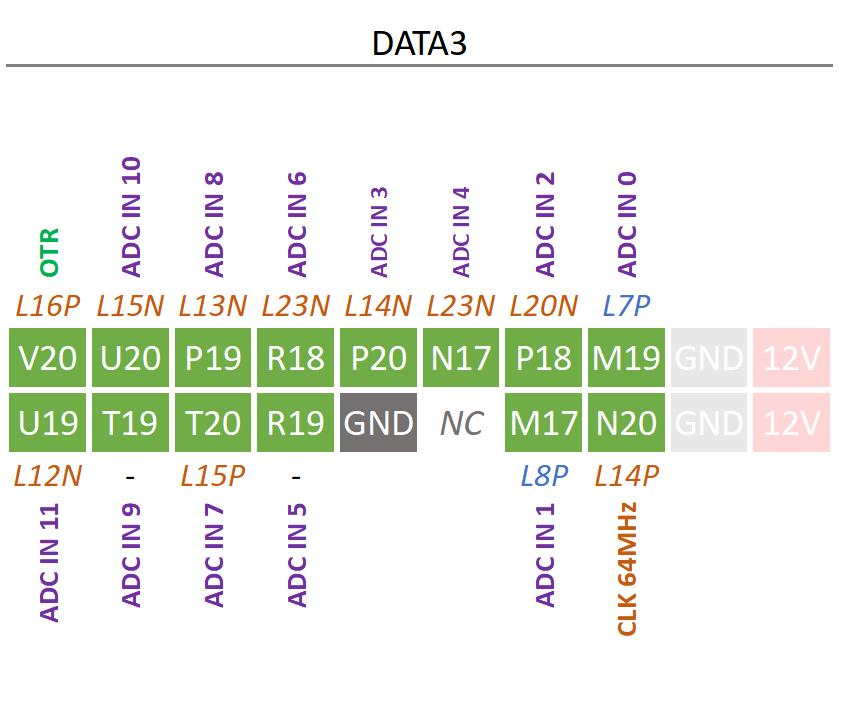
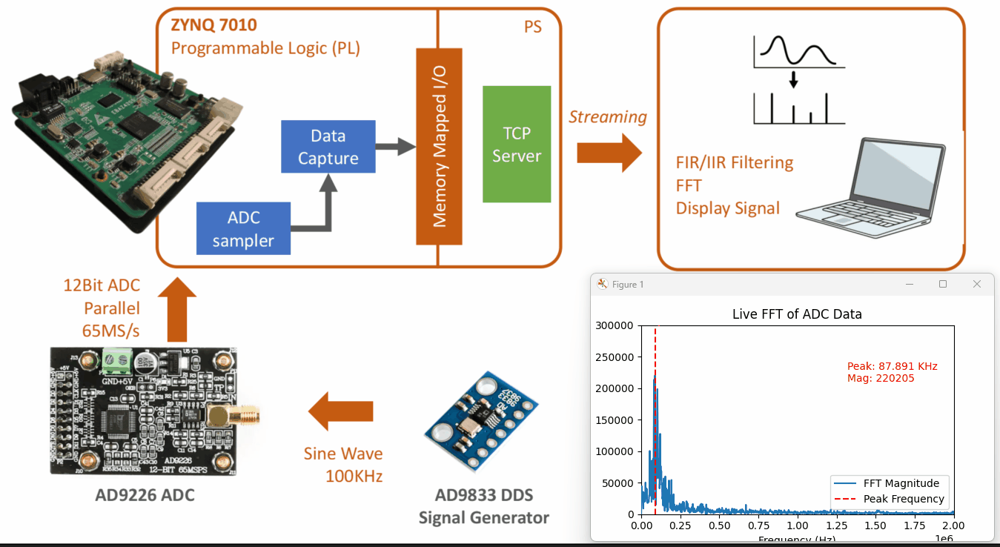
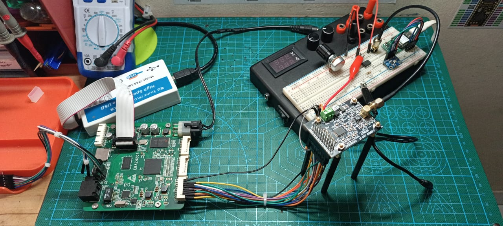

# Project Instruction
- The `src/` folder contain application code for running TCP Server to streaming ADC Data stored inMemory Mapped I/O in Xilinx SDK 2019.1 for EBAZ4205.
- To get started, 
    - Export Hardware Platform from [Vivado Project - AD9226 ADC](../../Vivado/7_AD9226_ADC/EBAZ4205_7_AD9226_DATA_CAPTURE.vivado/)
    - Launch Xilinx SDK from Vivado,
    - Then create New Application Project > **C++** with Name `AD9226_AXIS_CAPTURE_TEST`,
    - Choose Project Template `Empty Application`,
    - Copy everything inside the `src/` folder above into the `src/` folder of your `AD9226_AXIS_CAPTURE_TEST` project. 
    - Modify BSP setting > Add LwIP support,
    - Build and upload to EBAZ4205 using Xilinx Platform USB Cable.
    - Connect to EBAZ4205 Serial, check the TCP IP & Port for established TCP Server in PS EBAZ4205. 
- Run the [PythonClientApp](PythonClientApp/)
    - Open [client_app_signal_processing_FFT.py](PythonClientApp/client_app_signal_processing_FFT.py), 
    - And modify to the correct IP and Port used in TCP Server,
    ```
    TCP_IP = '192.168.0.126'    # IP of the FPGA board
    TCP_PORT = 7                # TCP port of the FPGA board
    ```
    - Run [client_app_signal_processing_FFT.py](PythonClientApp/client_app_signal_processing_FFT.py) in your host computer.
- On this project we are only used `DATA3` Port in EBAZ4205, <br>
    <br><br>
- Experiment result,
    - Display FFT of ADC Data in Python client app (Run in host Computer),
    - Establish TCP Server to streaming ADC data in EBAZ4205.<br><br>
    <br><br>
    